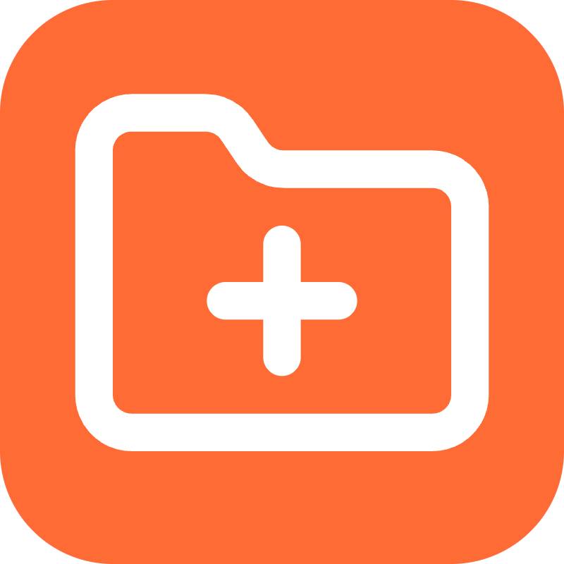

# Passive Language Learning New Tab

<p align="center">
  
</p>

<p align="center">
  <strong>Learn languages naturally through passive exposure. Every new tab shows a phrase matched to your level - no effort, just consistent micro-learning moments throughout your day. Currently supporting German, Spanish, French, and Arabic!</strong>
</p>

<p align="center">
  <a href="https://chromewebstore.google.com/detail/lcpngcpkmbdooibllkhggekgmcdgagln?utm_source=github-repo"><strong>Install from Chrome Web Store</strong></a>
  ·
  <a href="https://yassin-mokni.github.io/passive-language-learning-tab/"><strong>Landing Page</strong></a>
</p>

---

## Why Passive Language Learning?
As a heavy browser user, you open dozens of tabs daily. Instead of staring at a blank page, use those micro-moments for language learning. Passive exposure improves vocabulary retention and language familiarity without the pressure of formal study sessions.

## Features
- **CEFR Level System (A0-C2):** 560+ phrases per language ranging from beginner (A1) and slang (A0) to advanced academic language (C2).
- **4 Languages:** German 🇩🇪, Spanish 🇪🇸, French 🇫🇷, and Arabic 🇦🇪 (with RTL support).
- **Offline Dialogues:** Listen to 17 structured conversations for different levels and everyday situations.
- **Live Radio:** Tune into level-appropriate talk and news radio stations native to your target language.
- **Smart Learning Tools:** Save favorites, export phrases, and use the built-in Native Audio pronunciation.
- **Minimalist Design:** Clean interface that doesn't distract or impact browser performance.
- **Keyboard Shortcuts:** Built for power users (`Space` for next phrase, `R` for radio, `F` for favorites).

## Privacy First
We collect **zero** data. 
- No tracking, no analytics, no external servers. 
- All preferences are stored locally on your device.
- Completely open-source and transparent.

Check our full [Privacy Policy](https://yassin-mokni.github.io/passive-language-learning-tab/privacy.html).

## Installation

### From Chrome Web Store (Recommended)
1. Go to the [Chrome Web Store page](https://chromewebstore.google.com/detail/lcpngcpkmbdooibllkhggekgmcdgagln).
2. Click **Add to Chrome**.
3. Open a new tab and start learning!

### Manual Installation (For Developers)
1. Clone this repository:
   ```bash
   git clone https://github.com/yassin-mokni/passive-language-learning-tab.git
   ```
2. Open Chrome and navigate to `chrome://extensions/`.
3. Enable **Developer mode** in the top right corner.
4. Click **Load unpacked**.
5. Select the cloned `passive-language-learning-tab` directory.
